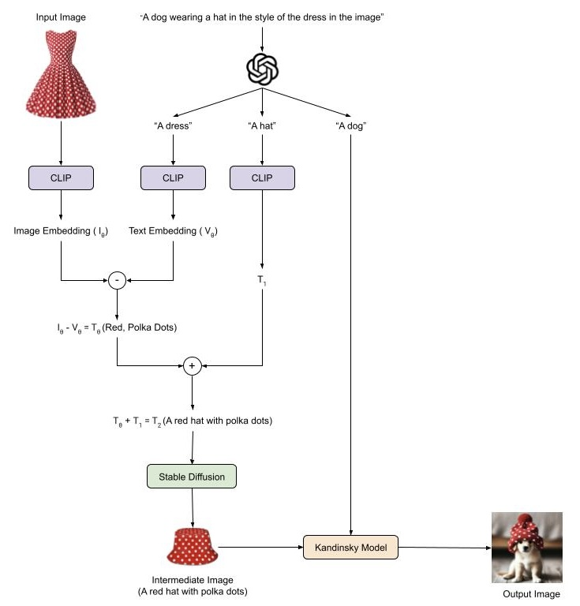
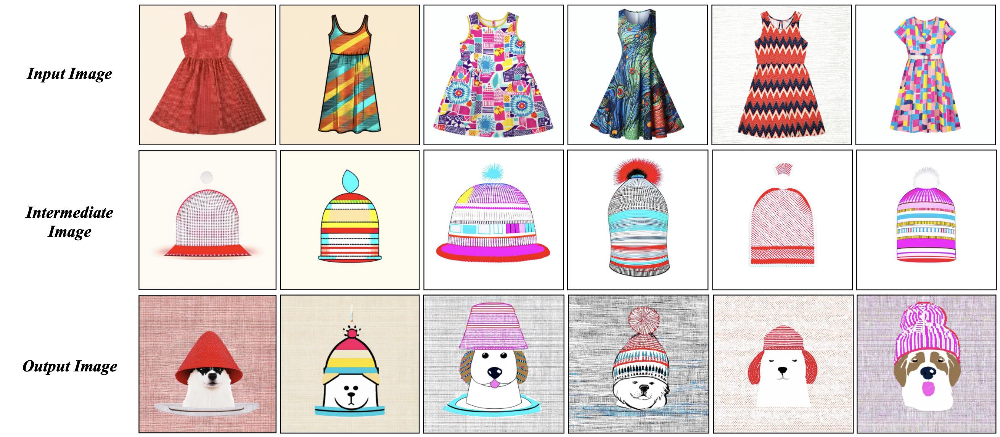

# Single-Shot-Appearance-Transfer

## Project Overview

The goal of this project is to develop a single-shot appearance (texture) transfer technique using CLIP abstraction. Given a textual description such as "a red dress with polka dots," the objective is to generate an image of a "dog wearing a hat that resembles the dress" by performing arithmetic in the latent space of the CLIP model. Traditional models struggle with accurate appearance transfer, making this task particularly challenging. Our approach involves developing an LLM agent to decompose the task into manageable sub-tasks and integrate multiple models for optimal results.

## Objectives

### Appearance Transfer via CLIP Abstraction:

- Utilize CLIP’s latent space to capture style and appearance.

- Perform arithmetic operations on CLIP latents to transfer style across objects.

- Develop an LLM agent to:

    - Decompose tasks into sub-tasks.

    - Integrate models such as Stable Diffusion or IP-adapter.

    - Generate final images based on textual prompts.

## Approach

### Choosing the Right LLM

- Evaluated various LLMs, including GROK, Llama, and GPT-4O.

- Selected Llama 3.1 8b Instruct for task decomposition and later transitioned to GPT-4O for improved performance and scalability.

- Deployed a secure EC2-hosted web app to facilitate API communication with GPT-4O.

### Designing Effective Prompts

- Created structured system prompts to ensure LLM accurately interprets user queries.

- Designed JSON-formatted outputs for CLIP and Stable Diffusion to receive clear, structured instructions.

### Text and Image Alignment using CLIP

- Integrated CLIP to align text and image embeddings in a shared latent space.

- Performed arithmetic operations on embeddings to enhance style and semantic feature merging.

- Explored embedding subtraction and addition to refine texture transfer accuracy.

### Model Selection and Integration

- Replaced IP-Adapter with Kandinsky model for improved texture-content alignment.

- Utilized Stable Diffusion XL for final image generation.

- Developed a decision-making framework to dynamically select models based on input prompts.

### Experimental Setup

- Created a custom dataset of 75 dress images using Stable Diffusion XL.

- Extracted style features from input images and performed embedding arithmetic to blend them with text prompts.

- Evaluated multiple methods for final image generation:

    - Direct IP-Adapter-based transformation.

    - Two-step blending approach using base image generation and texture merging.

### Evaluation and Results

- Used CLIP similarity scores to measure text-image alignment.

- Conducted human manual evaluations to assess visual quality, style fidelity, and semantic accuracy.

- Achieved significant improvements in pattern retention, semantic coherence, and real-world applicability.

